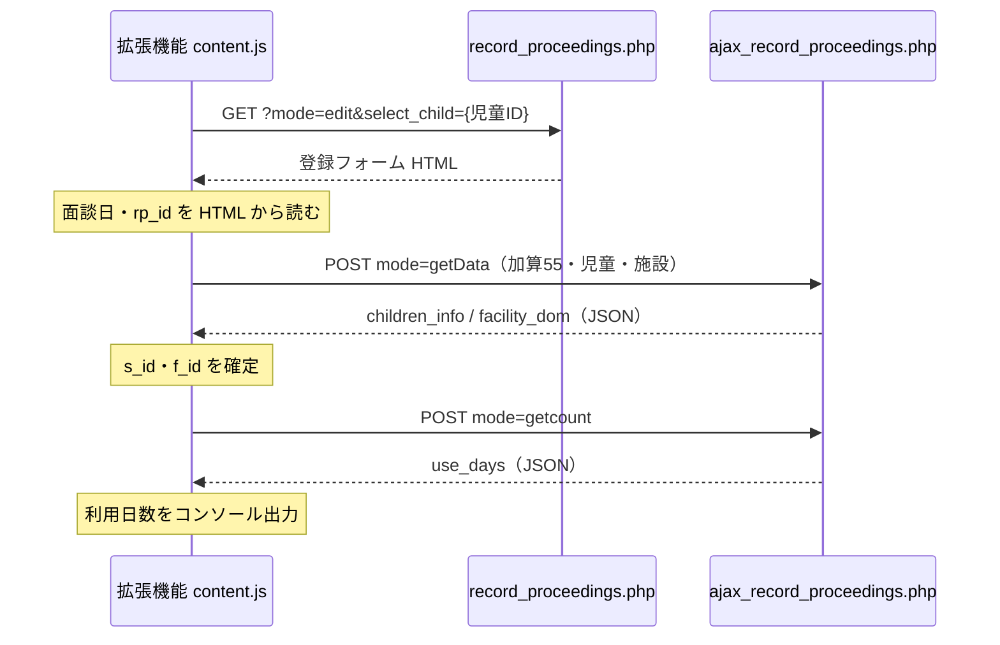

# 専門的支援 利用日数チェック（テスト拡張機能）

## 目的

HUG の **どのページからでも**、固定児童が **専門的支援実施加算（加算ID: 55）** の記録を **新規作成した場合に何日目になるか**（当月の利用日数）を、画面操作なしで確認する。

- 自動入力（加算選択・児童選択）は **別拡張機能** が担当
- 本拡張は **fetch による HTTP 通信のみ** で日数を取得する

## 設定値（content.js 先頭）

| 定数 | 値 | 意味 |
|------|-----|------|
| `FIXED_CHILD_ID` | `"99"` | 確認対象の児童 c_id |
| `DEFAULT_F_ID` | `"3"` | 利用施設 f_id（HTML 未選択時の既定。PD吉島など） |
| `ADDING_CHILDREN_ID` | `"55"` | 専門的支援実施加算 |

## 全体の流れ



## 処理ステップ詳細

### 1. 起動条件

- `manifest.json` により `https://www.hug-ayumu.link/hug/wm/*` の任意ページ読み込み時に `content.js` が実行される
- HUG に **ログイン済み**（`credentials: "include"` で Cookie を送信）

### 2. 登録フォーム HTML の取得（GET）

```
GET https://www.hug-ayumu.link/hug/wm/record_proceedings.php?mode=edit&select_child={FIXED_CHILD_ID}
```

**HTML から取るもの**

| 項目 | セレクタ例 | 用途 |
|------|------------|------|
| 面談日 | `[name=interview_date]` | getData / getcount の `interview_date` |
| 記録ID | `[name=id]`（通常 `insert`） | getData の `rp_id` |
| 児童の存在確認 | `.js_c_list option[value="{c_id}"]` | 一覧に児童がいるか |

**注意（実測で判明した点）**

- URL に `select_child` があっても、**児童は HTML 上では未選択のまま**（`js_c_list` の value は `0`）
- `js_children_area` は `display: none`
- `js_c_f_id` は **option が空**
- そのため **HTML だけでは s_id / f_id / 利用日数は取れない** → 次の getData が必須

### 3. 児童情報の取得（POST: getData）

サイト本体の `getRecordProceedingsData("children")` と同系の API。

```
POST https://www.hug-ayumu.link/hug/wm/ajax/ajax_record_proceedings.php
Content-Type: application/x-www-form-urlencoded
```

**送信パラメータ**

| パラメータ | 値 |
|------------|-----|
| `mode` | `getData` |
| `rp_id` | `insert`（HTML から） |
| `change_type` | `children` |
| `interview_date` | 例: `2026年05月20日` |
| `adding_children_id` | `55`（専門的支援実施加算） |
| `c_id_list[{c_id}]` | 児童ID（例: `99`） |
| `f_id_list[{c_id}]` | `DEFAULT_F_ID`（例: `3`） |

**レスポンスから取るもの**

- `children_info[c_id]` … HTML 断片（`.js_c_s_id` の **s_id** を含む）
- `facility_dom[c_id]` … 施設 `<select>` の HTML（**f_id** の selected）

GET では空レスポンスになり JSON 解析に失敗したため、**POST + `X-Requested-With: XMLHttpRequest`** で呼び出している。

### 4. 利用日数の取得（POST: getcount）

サイト本体の `getAttendCount()` と同じ API。

```
POST https://www.hug-ayumu.link/hug/wm/ajax/ajax_record_proceedings.php
```

**送信パラメータ**

| パラメータ | 値 |
|------------|-----|
| `mode` | `getcount` |
| `c_id` | 児童ID |
| `s_id` | getData で得た利用サービスID |
| `f_id_list` | getData で得た施設ID |
| `interview_date` | 面談日 |

**レスポンス**

```json
{
  "use_days": "<br>利用日数：N日"
}
```

正規表現 `利用日数[：:]\s*(\d+)\s*日` で **N** を数値化する。

### 5. コンソール出力

成功時の例:

```
[HUG WM] 専門的支援 利用日数チェック
[HUG WM] 児童ID: 99
[HUG WM] 面談日: 2026年05月20日
[HUG WM] s_id / f_id: 1 / 3
[HUG WM] 新規作成時の利用日数: N 日
```

## グローバル API（DevTools から手動実行）

```javascript
// 既定児童（FIXED_CHILD_ID）で実行
await HugSpecialSupportUseDays.fetchSpecialSupportUseDays();

// 児童を指定
await HugSpecialSupportUseDays.fetchSpecialSupportUseDays("541");

// HTML のみ取得
await HugSpecialSupportUseDays.fetchFormHtml("99");
```

## エラー時の主な原因

| メッセージ | 想定原因 |
|------------|----------|
| 登録フォームが取得できません | 未ログイン・セッション切れ |
| 児童ID が児童一覧に存在しません | `FIXED_CHILD_ID` の誤り |
| getData が空レスポンス / JSON解析失敗 | POST 未使用・パラメータ不正・サーバーエラー |
| 面談日・専門的支援の条件で選択できません | その日・加算の組み合わせで児童が選べない |
| getcount の解析失敗 | レスポンス形式の変更 |

## 関連ファイル

| ファイル | 役割 |
|----------|------|
| `content.js` | 上記ロジックの実装 |
| `manifest.json` | `hug/wm/*` で content script を注入 |
| `各種加算・議事録管理　登録フォーム _ 成長療育支援システム.html` | 保存した HTML の構造確認用 |
| `各種加算・議事録管理　登録フォーム _ 成長療育支援システム_files/record_proceedings.js` | 本家の `getAttendCount` / `getRecordProceedingsData` 参照用 |

## 本家 JavaScript との対応

| 本家（record_proceedings.js） | 本拡張 |
|------------------------------|--------|
| 児童 change → `getRecordProceedingsData("children")` | POST `mode=getData` |
| `#js_service` change → `getAttendCount()` | POST `mode=getcount` |
| `$(".js_use_days").html(data.use_days)` | `parseUseDaysNumber(data.use_days)` |
